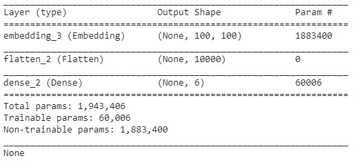

# NN-Project
A individual project for Neural Network course
### PROBLEM STATEMENT 
The goal of this research is to perform sentiment analysis for customer reviews and to predict a rating score for a restaurant based on the review analysis. The previous works on sentiment classification, such as using NLTK (Natural Language Toolkit) sentiment classifier, may not always get a satisfactory performance [1]. Therefore, a deep learning-based sentiment analysis model is proposed to achieve a higher prediction accuracy rate of rating score. In this project, I selected three types of Neural Network (NN): Feed Forward Neural Network, Convolutional Neural Network, and Recurrent Neural Network. All these three NN models are applied on the same textual review dataset to perform the rating prediction, and their prediction results are compared and evaluated. I also observed how the dimension of embedding layer impact the prediction performance by applying different dimensions of pre-trained word vector in each type of NN.

### DATASET 
In this research, a restaurant dataset from Kaggle [2] is used. This dataset contains 147 restaurants in San Francisco.

For each restaurant, there is many general information fetched from the Factual API [3], such as restaurant name, address, and overall rating score. The dataset also includes more than 50 customer reviews for each restaurant, which are collected from TripAdvisor [4]. All the data are in JSON format. This project focuses on the textual customer reviews of all restaurants.

### MODEL
I chose to use the basic structure of all these three neural network models. The batch size is 200 and the epoch is 30, which are the same for training each NN model. Also, to compile each model, the adam optimizer is used and the mean squared error is selected as the loss function during the training process. For each NN model, the summary of its structure is shown as below.
* Feed Forward Neural Network

